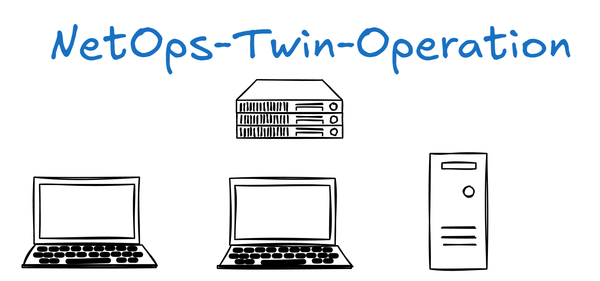

<div align="center">
  
  <h1>NetOps 网络运维数字孪生系统</h1>
  <p>基于 NetOps 理念的网络运维数字孪生系统，通过 YAML 脚本定义网络设备参数，使用 Three.js 进行 3D 可视化展示，实现网络拓扑的数字孪生仿真。</p>

  <p>
    <a href="https://github.com/Adorrain/NetOps-Twin-Operation"></a>
    <a href="https://github.com/Adorrain/NetOps-Twin-Operation/tags"></a>
    <a href="./backend"></a>
    <a href="./frontend"></a>
    <a href="./frontend"></a>
    <a href="./frontend"></a>
    <a href="./docker-compose.yml"></a>
  </p>
</div>

## 项目概述

本项目旨在创建一个现代化的网络运维管理平台，通过数字孪生技术实现网络设备的 3D 可视化展示和运维管理。系统支持通过 YAML 配置文件定义网络拓扑结构，包括 PC、路由器、交换机等设备的参数配置，并在前端通过 Three.js 进行逼真的 3D 渲染展示。

## 文档

- 技术文档（产品定位/设计/技术栈/前后端/数据库/接口与响应格式）：[docs/techdocs.md](docs/techdocs.md)

## 核心功能

- 🌐 **网络拓扑可视化**: 基于 YAML 配置的 3D 网络拓扑展示
- 🔧 **设备参数管理**: 支持 PC、路由器、交换机等设备的参数配置
- 📊 **实时监控**: 网络设备状态和性能实时监控
- 🎮 **交互式运维**: 3D 场景中的设备交互和运维操作
- 📱 **现代化界面**: 响应式设计，支持多设备访问

## 技术栈

### 前端技术

- **React（当前实现为 JSX/JavaScript）**: 现代化前端开发框架
- **Three.js**: 3D 图形渲染引擎
- **React Three Fiber**: React 的 Three.js 渲染器
- **Tailwind CSS**: 现代化 CSS 框架
- **Zustand**: 轻量级状态管理
- **Vite**: 快速构建工具

### 后端技术

- **Python 3.10+**: 后端开发语言
- **FastAPI**: 现代化 Web 框架
- **Pydantic**: 数据验证和序列化
- **PyYAML**: YAML 配置文件解析
- **SQLAlchemy**: ORM 与数据库访问
- **NetworkX**: 拓扑图与路径计算（仿真）

## 快速开始

### 环境要求

- Node.js 18+
- Python 3.10+
- npm 或 pnpm

### 安装依赖

```bash
# 安装前端依赖
cd frontend
npm install

# 安装后端依赖
cd ../backend
pip install -r requirements.txt
```

### 开发环境启动

```bash
# 启动前端开发服务器
cd frontend
npm run dev

# 启动后端API服务器
cd backend
python main.py
```

## 使用说明

1. **准备网络拓扑配置**: 参考 `docs/techdocs.md` 的 YAML 示例编写配置
2. **上传配置文件**: 通过前端界面上传或编辑 YAML 配置
3. **3D 可视化**: 系统自动解析 YAML 并生成 3D 网络拓扑图
4. **网络运维**: 在 3D 场景中进行设备交互和运维操作

## 配置文件格式

系统使用 YAML 格式定义网络拓扑结构，核心字段为 `topology / devices / links`：

- `topology`: 拓扑信息（name、type）
- `devices`: 设备列表（id、name、role、deviceType/device_type、ip、interfaces、configuration 等）
- `links`: 链路列表（id、src_device、dst_device、src_interface、dst_interface、status 等）

拓扑变化 / ping失败
↓
构建运行态快照
↓
规则引擎分析
↓
生成事实层结构
↓
AI Agent增强分析
↓
生成结构化报告
↓
存储 AnalysisReport
